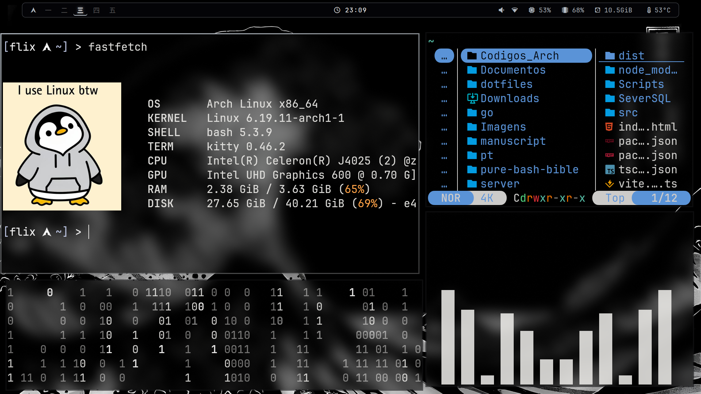
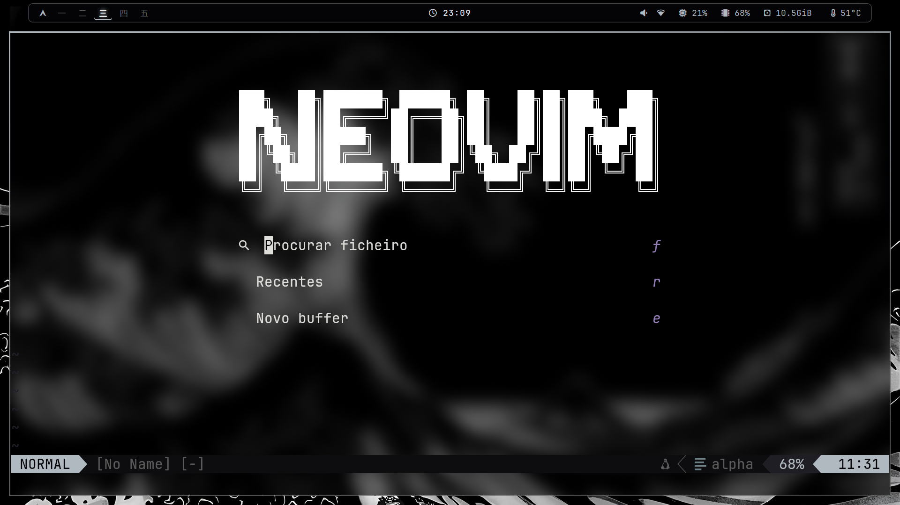
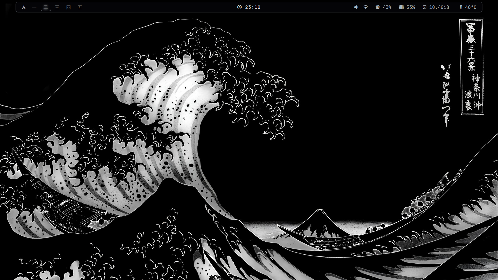
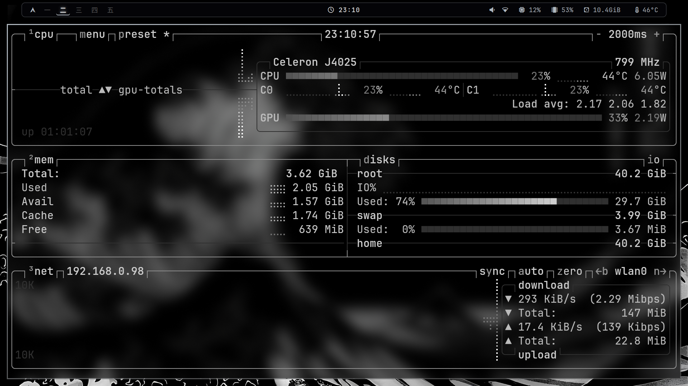

# 🧪 The Cyber-Scientific Sanctuary (Arch/Hyprland Dotfiles)
> "Science is not magic, sir. It's simply what happens when you stop using the mouse like a caveman."

Welcome to my configuration repository. Herein lies proof that human patience is finite, but the capacity to customise Arch Linux is infinite. This is not merely a collection of `.conf` files — it is the scientific blueprint for elite-level efficiency.

## 🛠️ Lab Components — Quick Diagnostics

| Module | Description | Excitement Level |
| :--- | :--- | :--- |
| **Hyprland** | Where window physics happen. No lag — pure logic. | 10,000,000,000% |
| **Waybar** | A status bar so clean it would make a microscope feel inadequate. | Absurd |
| **Neovim** | Where backend development comes alive through Lua. If you use VS Code, I grieve for your primitive soul. | Vital |
| **AnyRun** | The elite launcher. Extensible, fast, and built for those who have no patience for primitive interfaces. | Superior |
| **Yazi** | The definitive CLI file manager for the Arch Linux + Hyprland ecosystem. | Supreme |

## 🚀 Scientific Protocol — Installation

If you are a promising lab colleague, you already know not to skip steps. Follow the logical process — one step at a time.

**1. Clone this anomaly:**
```bash
git clone https://github.com/flixgamerd/Hyprland-Config.git ~/dotfiles
```

**2. Elite bridging (symlinks):**
Do not create redundant folders like a caveman. The commands below establish the correct neural connections:
```bash
ln -s ~/dotfiles/waybar   ~/.config/waybar
ln -s ~/dotfiles/anyrun   ~/.config/anyrun
ln -s ~/dotfiles/nvim     ~/.config/nvim
ln -s ~/dotfiles/hypr     ~/.config/hypr
ln -s ~/dotfiles/yazi     ~/.config/yazi
```

**3. The awakening:**
Ensure your wallpaper path is not a ghost variable. `awww` requires absolute paths to avoid an existential crisis:
```bash
# In your hyprland.conf:
exec-once = awww-daemon && sleep 0.5 && awww img "/home/user/dotfiles/wallpapers/Wave.jpg"
```

## 📸 The Aesthetic Blueprint — Visual Documentation

### System Diagnostics & Architecture
The foundation of any civilized setup. Your machine's heartbeat, rendered with scientific precision.



### Editor Throne: Neovim
Where the actual work happens. Lua configurations, zero compromises, and keyboard supremacy. VS Code users are not invited to this section.



### Aesthetic Materialization: The Great Wave
The wallpaper philosophy made manifest. Katsushika Hokusai meets Hyprland. Proof that scientific precision and visual poetry are not mutually exclusive.



### System Monitoring in Real-Time
btop displaying CPU, memory, disk, and network metrics. The machine talks; you listen.



## 🎨 Theming Architecture

Your environment is composed of three interconnected aesthetic layers:

- **Hyprland Borders & Decorations**: Configured via `hyprland.conf` for crisp window management.
- **Waybar CSS**: Flat design, monochromatic elegance, responsive to system state.
- **Neovim Theme**: `kanagawa-wave` with custom highlights — syntax that respects your retinas at 2300 hours.
- **AnyRun Launcher**: Manthey palette initially, evolved to Montanha green, now refined to Great Wave aesthetics.

All components share a unified color philosophy: **minimal, purposeful, scientifically justified**.

## 🔧 Configuration Topology

```
dotfiles/
├── hypr/
│   ├── hyprland.conf          # Core window manager configuration
│   ├── hyprpaper.conf         # Wallpaper daemon settings
│   └── hypridle.conf           # Idle behavior & screensaver integration
├── waybar/
│   ├── config.jsonc           # Bar structure & modules
│   └── style.css              # Visual refinement
├── nvim/
│   ├── init.lua               # Entry point
│   ├── lazy-lock.json         # Dependency lock
│   └── lua/
│       ├── config/            # Core settings
│       ├── plugins/           # Plugin specifications
│       └── lsp/               # Language server configurations
├── anyrun/
│   └── config.ron             # Launcher behavior
├── yazi/
│   ├── yazi.toml              # File manager config
│   └── theme.toml             # Color scheme
└── wallpapers/
    └── Wave.jpg               # The Great Wave (inverted aesthetic)
```

## 🧬 Scientific Dependencies

Ensure these packages are installed:

```bash
pacman -S hyprland waybar neovim yazi anyrun btop wl-clipboard swww awww

# For Neovim development:
pacman -S npm rust ripgrep fd
```

Optional but recommended:
```bash
pacman -S grimblast        # Wayland-native screenshots
pacman -S wf-recorder      # Screen recording without compromising FPS
pacman -S dunst            # Notification daemon (minimal)
```

## 🚦 Current Status

| Component | Version | Status |
| :--- | :--- | :--- |
| Arch Linux | Latest | ✓ Rolling |
| Hyprland | v0.x+ | ✓ Active |
| Neovim | 0.10+ | ✓ Optimized |
| Waybar | Latest | ✓ Refined |
| Yazi | Latest | ✓ Deployed |

## 📝 License

This configuration is provided as-is. Modify it. Break it. Rebuild it better. Science is iterative.

---

**Last updated:** April 2026  
**Maintained by:** flixgamerd (Flix)  
**Aesthetic Phase:** *The Great Wave* (Monochromatic Refinement)
